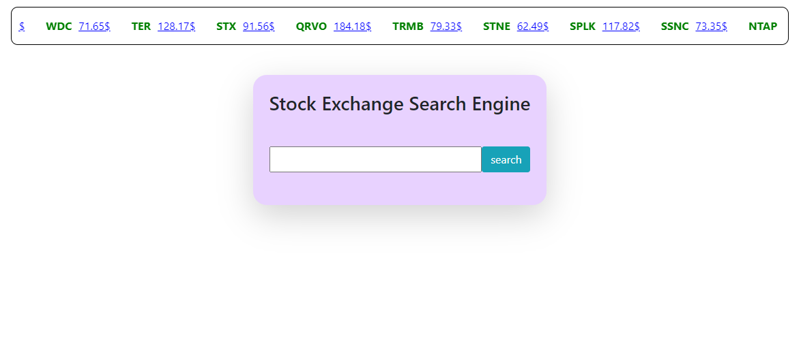

# Stock Exchange Search Engine

## Description
One of my first projects. A search engine connected to Nasdaq data real time, capable of searching and displaying Companies current and past information.

## Usage

For live demo: https://ido-stock-exchange.netlify.app/

### to run on your own computer

After cloning the repo run
```bash
npm install
```

after that, opening the code in your browser of choice will result in this image:



from this point you are free to use the search engine.


## License
[MIT](https://choosealicense.com/licenses/mit/)

